# Crack detection using OpenCV

### Abstract
It has been seen that millions of dollars are being invested on highway/subway tunnel maintainance and restoration all over the world. This cost can be minimized if the detection of cracks will be found as earlier as possible. As the reparation process depends on the type of cracks, so we need to take actions for next steps how it would be repaired. It would be a very good decision to repair the cracks as earliar we find it. Initially we need to capture very transperant images of the roads/concrete infrastuctures. Cause detections will depend on that images. So any device that will be used to scan or capture images of the roads/concrete infrastuctures, that must be configured for picturing high resolution images. On those images, various image processing techniques are applied to extract crack information. Depending on these information, the images could be classified using some decision making algorithm. This procedure can be implemented on images acquired by any objects or vehicles carrying image sensing terminal, laser distance sensor, image storage and processing servers, central control system and speed sensor. The accuracy depends on the images quality and accurate capture.

### Introduction
Whenever we travel what we need at first is road safety. So if we can confirm that conditions of our highway is okay, then accidents will be decreased automatically. Since the highways are built, it can be seen the cracks or holes in the asphalt/concrete surface. As soon as we repair our cracks, our journey will be safe for sure. Most of cases the accidents happen due to the poor condition of the road.

In very modern countries, they have thousands of kilometers highways. It's very difficult to inspect these roads by manpower. So an efficient automatic detection of the road condition can be developed for making them safe.

These cracks of the highways can be classified into some types. Depending on those cracks, authority must take actions how those would have to repair. Initially it may need to detect the location of the cracks. To perform that, a visual inspection technique is needed to capture images of the roads and then to be analyzed.

So our ultimate goal is to develop a system that can be able to detect these cracks on the highways automatically.

### Methodology
Here the crack detection methodology can be classified into some following steps below:
1. Image capture
2. Image processing
3. Image Segmention
4. Feature extraction

#### Image capture
Any device can be installed on a vehicle zenith point or in a pole that is capable of capturing high resoluted imgaes of higways from any angle but focus should be perfect. If needed then the original images could be resized. Here are some examples of images on which we are going to detect cracks.

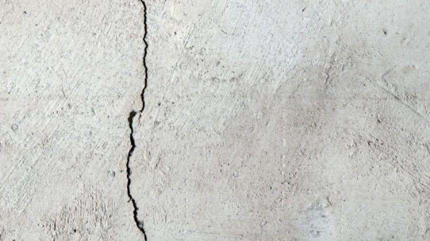 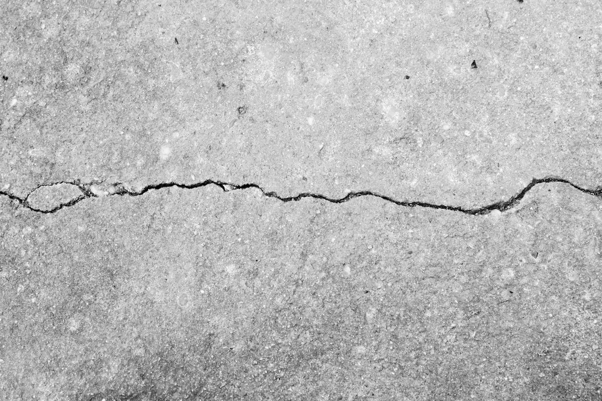

#### Image processing techniques
All the steps in the processing section are being explained below. 

##### Gray scaling and averaging
Firstly, the images is transformed in a new one in grayscale and blur. These make the images easier to visualize the processed images in next steps. 

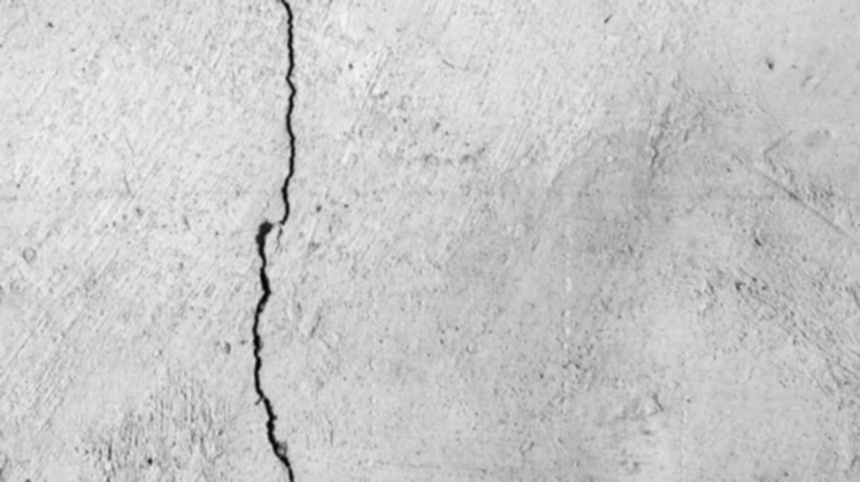 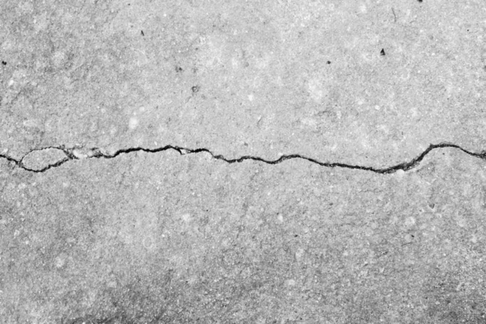
<pre>              Blurred Image                                           Blurred Image</pre>

##### Logarithmic transformation
Logarithmic transformation is used to replace all the pixels values of an image with its logarithmic values. This transformation is used for image enhancement as it expands dark pixels of the image as compared to higher pixel values. So if we apply this method in an image having higher pixel values then it will enhance the image more and actual information of the image will be lost. Now after applying the log transformation in to our sample blurred images, they look like below.

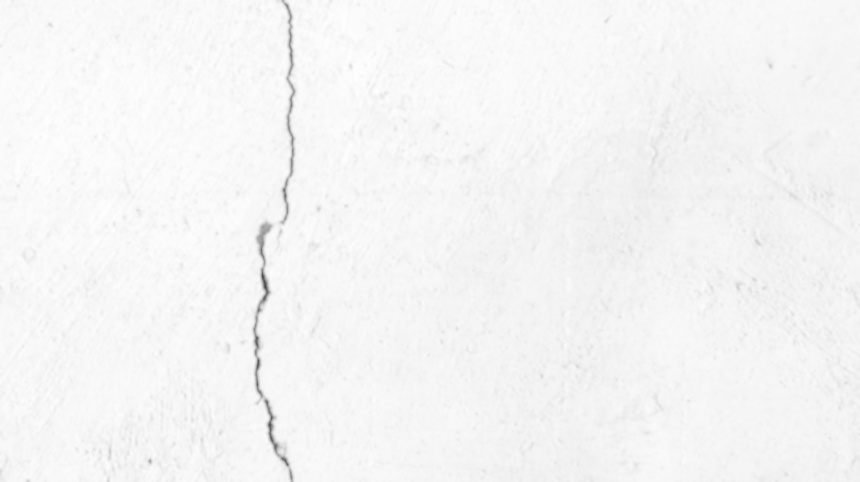 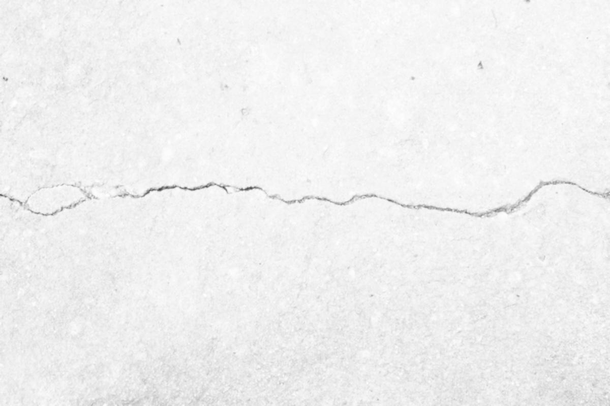
<pre>           Log Transformed Image                                   Log Transformed Image</pre>

##### Image smoothing: bilateral filter
The bilateral filter also uses a Gaussian filter in the space domain, but it also uses one more (multiplicative) Gaussian filter component which is a function of pixel intensity differences. This method preserves edges, since for pixels lying near edges, neighboring pixels placed on the other side of the edge, and therefore exhibiting large intensity variations when compared to the central pixel, will not be included for blurring. So the sample logarithmic transformed images become as following after applying the bilateral filtering.

 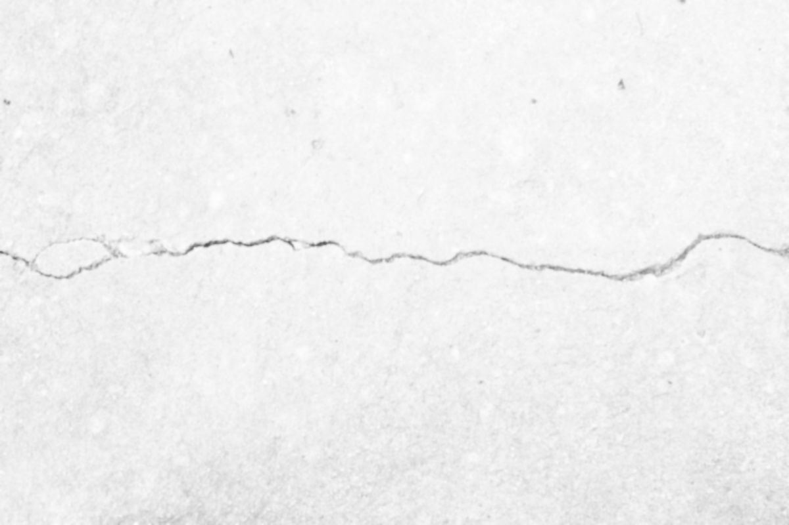
<pre>           Bilateral Filtered Image                           Bilateral Filtered Image</pre>

#### Image Segmention Techniques
##### Canny edge detection
Canny edge detection is a technique to extract useful structural information from different vision objects and dramatically reduce the amount of data to be processed. It uses a multi-stage algorithm to detect a wide range of edges in images. 
Canny algorithm consists of three main steps:

1. Find the intensity gradient of the image: In this step the scale of the gradient vector is calculated for each pixel.
2. Non-maximum suppression: The aim of this step is to “thin” the edge to obtain a one-pixel width edge.
3. Threshold hysteresis: Finally, a two-step threshold hysteresis is applied in order to decrease the fake edges.

Now we apply canny algorithm to detect the crack edges in our bilateral filtered as following.

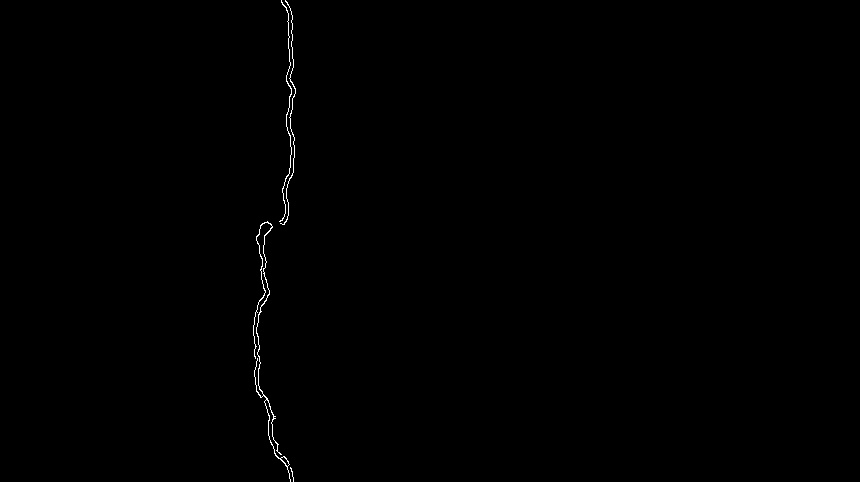 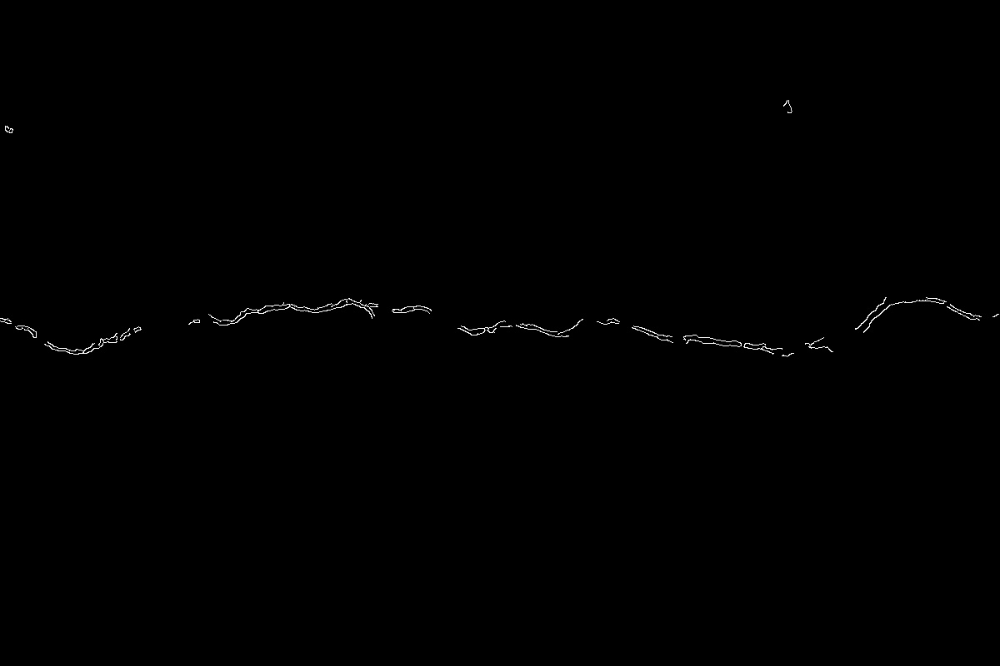
<pre>           Canny Edges Image                                   Canny Edges Image</pre>

##### Morphological closing operator
Morphological transformations are some simple operations based on the image shape. It is normally performed on binary images. It needs two inputs, one is our original image, second one is called structuring element or kernel which decides the nature of operation. 

There are many different types of morphological filtering, but after analyzing the results, the best filter for this detection is the closing filter. Closing filter helps to fill minor gaps in the image making the main crack continuous and more detailed. It is useful in closing small holes inside the foreground objects, or small black points on the object. Closing filter is defined as a dilation followed by an erosion.

Here we go to apply the morphological closing operator onto our canny edges detected images.

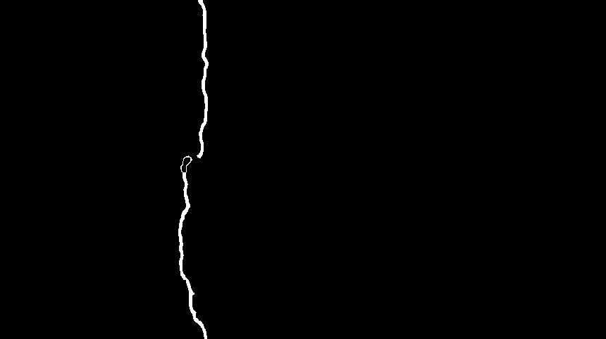 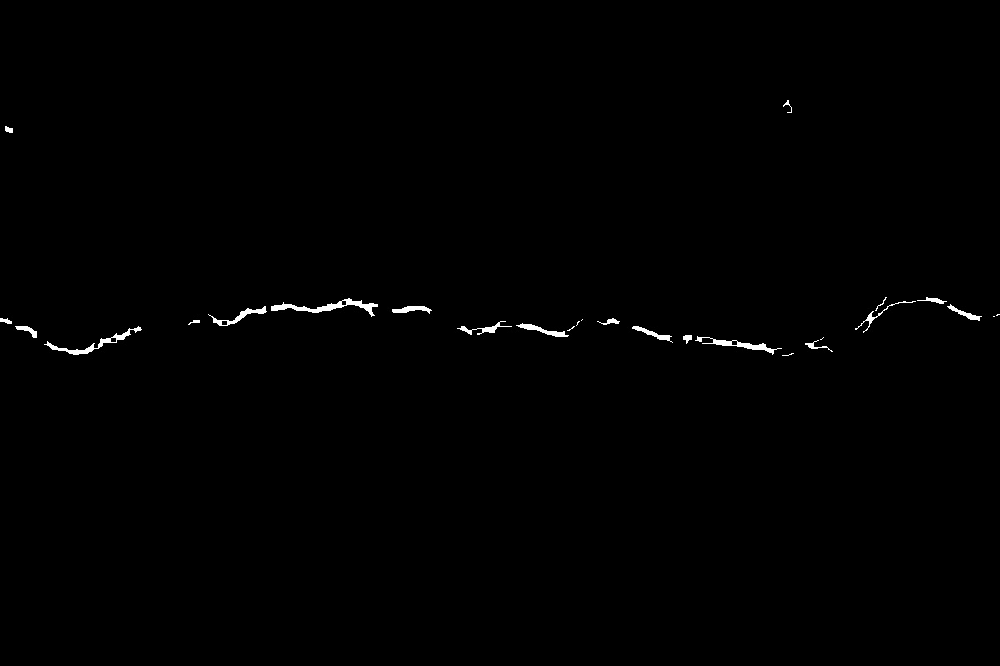
<pre>           Morphological Closing Image                          Morphological Closing Image</pre>

#### Feature extraction
There are various types of algorithm like (SIFT, SURF, ORB) that could be used in feature detection/extraction. SIFT and SURF are patented so not free for commercial use, while ORB is free. SIFT and SURF detect more features than ORB, but ORB is faster. ORB stands for Oriented FAST and Rotated BRIEF. It combines features of FAST and BRIEF for feature extraction and description. It has very fast computational speed, efficient memory usage, and high matching accuracy. ORB can be used instead of SIFT and SURF for feature extraction. 

So after applying this ORB method into our morphological closing images we get the result as following.

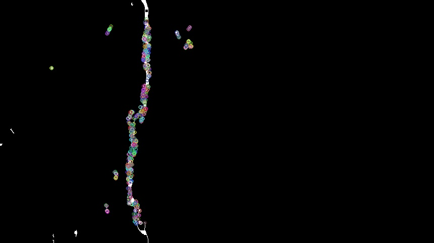 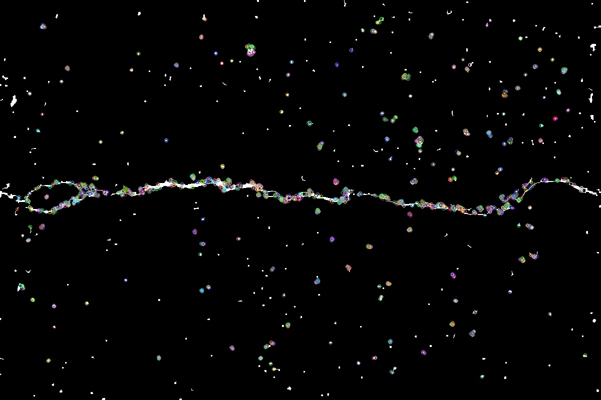
<pre>           Feature Detected Image                              Feature Detected Image</pre>

### Result and discussion
Here we tried with around twenty images of both crack and non-crack to test. Without some cases, the cracks become very visible accurately in our output image. So we can say that 80-90% accuracy can be possible if the images are very clear or transparent. From our final output images we can classify them into several crack types and some classification techniques need to be applied for that.

### References
1. M Ann, P Johnson, Best Practices Handbook on asphalt pavement maintenance.Minnesota Technology Transfer (T2) Center / LTAP Program (2000). http://www.cee.mtu.edu/~balkire/CE5403/AsphaltPaveMaint.pdf.

2. TD Donald Walker, Pavement Surface Evaluation and Rating (PASER) Manuals (Wisconsin Transportation Information Center, Wisconsin, 2002). http://www.apa-mi.org/docs/Asphalt-PASERManual.pdf.

3. RK Kay, Pavement Surface Condition - Rating Manual. Northwest Technologies Transfer Center. Northwest Technologies Transfer Center. Washington State Department of Transportation, (Washington, 1992).

4. L Li, L Sun, G Ning, S Tan, Automatic pavement crack recognition based on Bp neural network. PROMET-Traffic Transp. 26(1), 11–22 (2014).

5. NHTSA, National Motor Vehicle Crash Causation Survey Report to Congress, (2008). http://www-nrd.nhtsa.dot.gov/Pubs/811059.PDF, Accessed Jan 2017.

6. JM Palomares, J González, E Ros, in AERFAI 2005. Detección de bordes en imágenes con sombras mediante LIP–Canny (Simposio de Reconocimiento de Formas y Análisis de Imágenes, AERFAI’2005, At Granada, 2005).

7. JS Miller, RB Rogers, GR Rada, in Distress Identification Manual for the Long-Term Pavement Performance Project. Appendiz A - Pavement Distress Types and Causes (National Cooperative Highway Research Program, At NW Washington, 1993), pp. 1–31.
